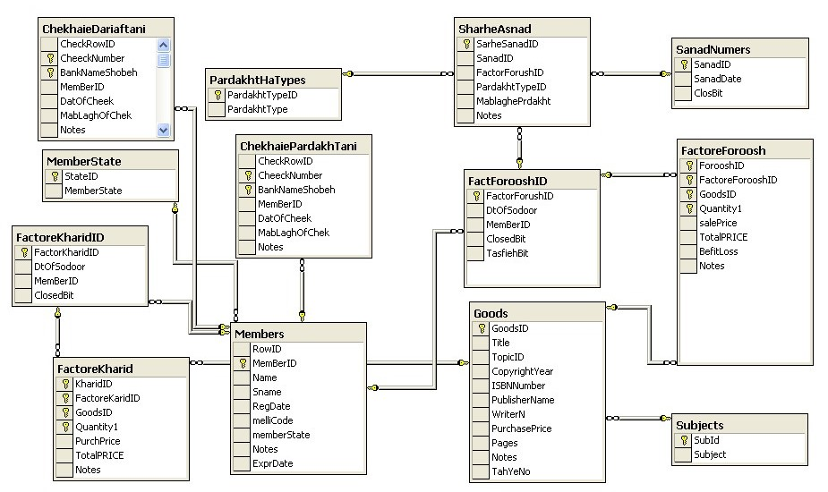

# Mobile Online Shop - System Design Project

## 📱 Project Overview

This repository contains a comprehensive **Software System Design** for a **Mobile Online Shop** application. This project was developed as part of the Systems Analysis and Design course in my Bachelor program (January 2021).

## 🎯 Project Purpose

This project serves as a complete system design blueprint for developing a mobile e-commerce application. It provides comprehensive documentation covering all aspects from business requirements to technical implementation details, designed to guide developers in building the actual mobile online shopping system.

## 🏗️ Methodology

The project follows the **Rational Unified Process (RUP)** methodology, which provides a disciplined approach to:
- Assigning tasks and responsibilities within a development organization
- Ensuring quality control and risk management
- Managing software development through iterative and incremental processes

## 📋 Project Components

### Core Documentation
- **📄 Business Case** - Business justification and requirements analysis
- **👁️ Vision Document** - Overall system vision and strategic goals
- **📚 Glossary** - Key terms and concepts definitions

### System Design Artifacts
- **🎯 Use Case Diagrams** - User interactions and system functionality
- **🏗️ Class Diagrams** - Object-oriented design and data structure
- **🗄️ Entity Relationship Diagram (ERD)** - Database design and relationships
- **🔄 Sequence Diagrams** - System component interaction flows

### Implementation
- **📱 Prototype** - Working prototype of the mobile online shop interface

## 📁 File Structure

```
system-design-main/
├── Business Case.docx/pdf          # Business requirements and justification
├── Vision.docx/pdf                 # System vision and goals
├── ERD.jpg                         # Database relationship diagram
├── full class diagram.jpg          # Complete class structure
├── full usecase diagram.jpg        # Complete use case interactions
├── glossary.docx/pdf               # Terminology and definitions
├── help.docx/pdf                   # System help documentation
├── usecase+sequence+erd+class+prototype.docx/pdf  # Comprehensive documentation
└── README.md                       # This file
```

## 📊 System Design Diagrams

### Entity Relationship Diagram (ERD)

*Database design showing relationships between entities*

### Full Class Diagram

*Complete object-oriented design showing all classes and their relationships*

### Full Use Case Diagram

*Comprehensive use case diagram showing all user interactions with the system*

## 🚀 Getting Started

### Prerequisites
- PDF viewer for documentation files
- Word processor for .docx files
- Image viewer for diagram files (.jpg)

### Viewing the Documentation
1. Start with the **Business Case** to understand the project requirements
2. Review the **Vision Document** for strategic context
3. Examine the **Use Case Diagrams** to understand system functionality
4. Study the **Class Diagrams** and **ERD** for technical architecture
5. Review **Sequence Diagrams** for system interactions
6. Explore the **Prototype** for user interface design

## 🎓 Academic Context

- **Course**: Systems Analysis and Design
- **Program**: Bachelor's Degree - Islamic Azad University south tehran branch
- **Date**: January 2021

## 📖 Documentation Format

The project documentation is available in multiple formats:
- **Microsoft Word (.docx)** - Editable format for modifications
- **PDF** - Fixed format for sharing and printing
- **Images (.jpg)** - Visual diagrams and prototypes

## 🔍 Key Features of the System Design

- **Mobile-First Approach** - Designed specifically for mobile devices
- **E-commerce Functionality** - Complete online shopping experience
- **User-Centric Design** - Focus on customer experience and usability
- **Scalable Architecture** - Designed for growth and expansion
- **Comprehensive Documentation** - Complete system specification

## 🤝 Contributing

This is an academic project, but suggestions for improvements are welcome. Please ensure any modifications maintain the academic integrity and RUP methodology structure.

## 📄 License

This project was created for academic purposes as part of a Systems Analysis and Design course.

---

**Note**: This is a system design documentation project, not a working application. It serves as the planning and design phase documentation that would guide the actual development of a mobile online shopping platform.
