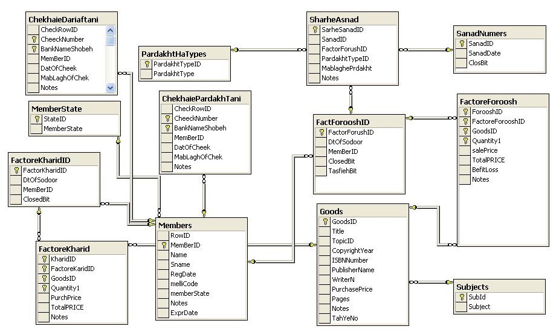

# System design for a mobile online shop

Project for the Systems Analysis and Design course in my bachelor's at Islamic Azad University, South Tehran Branch. I designed a mobile online shop following the Rational Unified Process (RUP). There is no code here, only the design documents.

- `Business Case`: why the shop is needed and what it should achieve.
- `Vision`: scope, users and main features.
- `glossary` and `help`: terms and user help.
- `usecase+sequence+erd+class+prototype`: use case, sequence and class diagrams, the ER diagram and screens of the prototype.

Every document is included as .docx and .pdf.

